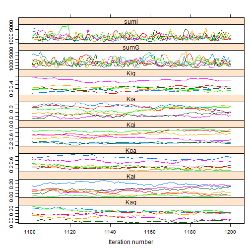
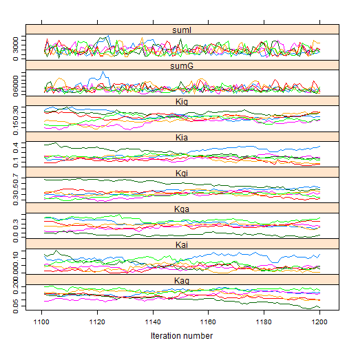
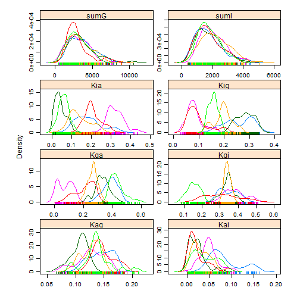
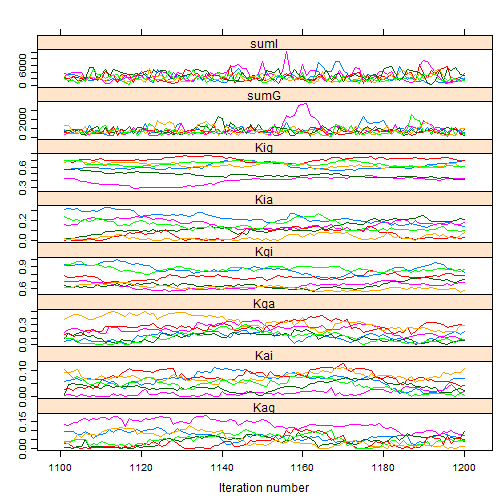
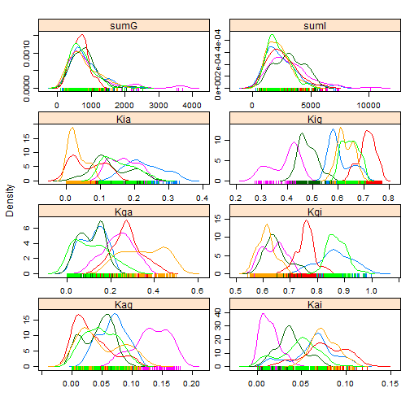
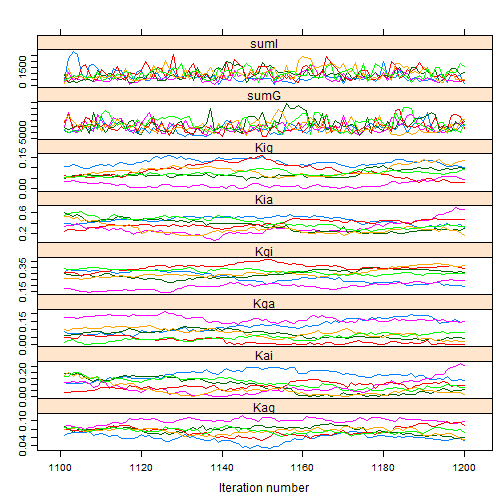
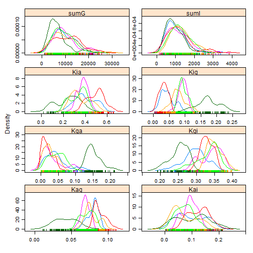
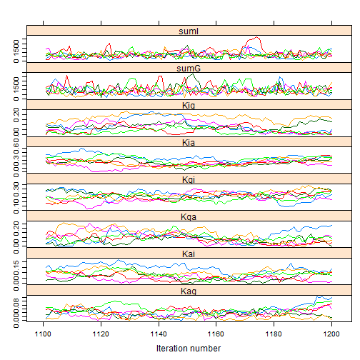
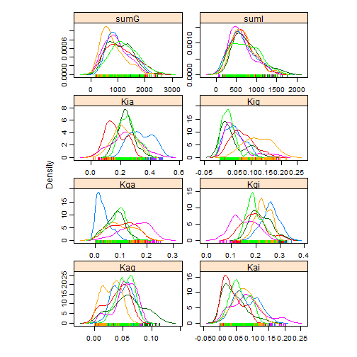

<!-- Specify the report's official name, goal & description. -->
# Diffusion results
**Report Goal**:  Provide a minimalistic report prototype for future reports.
**Report Description**: This is a prototype of a simple report.  It should represent the one side of the spectrum of MIECHV automated reports..

<!-- Point knitr to the underlying code file so it knows where to look for the chunks. -->


### Cohort: 1980
Andrey -write something here.

```r
cohortYear <- 1980
```


```r
require(rjags)
```

```
## Loading required package: rjags
```

```
## Loading required package: coda
```

```
## Loading required package: lattice
```

```
## Linked to JAGS 3.3.0
```

```
## Loaded modules: basemod,bugs
```

```r
# require(coda)
rjags::load.module("dic")  # load a few useful modules (JAGS is modular in design): https://sites.google.com/site/autocatalysis/bayesian-methods-using-jags
```

```
## module dic loaded
```

```r


pathDirectory <- file.path(getwd())

{
    #This bracket permits the 'else' clause (because it's located on the top layer of the code.)
    if (basename(getwd()) == "EMOSA") {
        #This clause executes when run from the *.R file.
        # pathDirectoryCode <- file.path(getwd(), 'Dal', 'GpavSurveyExtractor.R')
        pathModel <- file.path(pathDirectory, "DiffusionOnly/DiffusionBeta.bugs")
        pathData <- file.path(pathDirectory, "Data/SummaryBirthYearByTime.csv")
    } else if (basename(getwd()) == "DiffusionOnly") {
        #This clause executes when run from the *.Rmd/Rnw file.
        # pathDirectoryCode <- file.path(dirname(dirname(getwd())), 'Dal',
        # 'GpavSurveyExtractor.R')
        pathModel <- file.path(dirname(pathDirectory), "DiffusionOnly/DiffusionBeta.bugs")
        pathData <- file.path(dirname(pathDirectory), "Data/SummaryBirthYearByTime.csv")
    } else {
        stop(paste0("The working directory '", basename(getwd()), "' was not anticiapted.  If appropriate, please go near the top of the 'OchaReport1.R' code and add this new location."))
    }
}

# pathModel <- file.path(pathDirectory,
# 'DiffusionOnly/DiffusionGauss.bugs') pathModel <-
# file.path(pathDirectory, 'DiffusionOnly/DiffusionLogit.bugs')

# curve(dbeta(x, 1,1)) curve(dbeta(x, 10,10)) curve(dlogis(x, location =
# .25, scale = 1), xlim=c(-5, 5))


ds <- read.csv(pathData, stringsAsFactors = FALSE)
ds <- ds[ds$byear == cohortYear, ]  #Select only the desired cohort
ds <- ds[order(ds$time), ]  #Sort, just, to make sure values will be passed to JAGS in the correct order.

pg <- ds$ProportionGoers
pi <- ds$ProportionIrregulars
pa <- ds$ProportionAbsentees

# Proportion of Goers, of Irregulars, or Nongoers (or absentees) {Check
# these with data; I may have messed up the order} For the 1984 cohort pg
# <- c(0.401088929, 0.340290381, 0.249546279, 0.218693285, 0.180580762,
# 0.167876588, 0.157894737, 0.158802178, 0.161524501) pi <- c(0.233212341,
# 0.256805808, 0.288566243, 0.305807623, 0.27676951, 0.270417423,
# 0.229582577, 0.250453721, 0.237749546) pa <- c(0.36569873, 0.402903811,
# 0.461887477, 0.475499093, 0.542649728, 0.561705989, 0.612522686,
# 0.590744102, 0.600725953)
timeCount <- length(pg)
if (length(pi) != timeCount) stop("The proportions have a different number of time points.")
if (length(pa) != timeCount) stop("The proportions have a different number of time points.")
mean(c(pg, pi, pa))
```

```
## [1] 0.3333
```

```r

jagsData <- list(pg = pg, pi = pi, pa = pa, timeCount = timeCount)

# parameters <- c('mu')
parametersToTrack <- c("Kgi", "Kga", "Kig", "Kia", "Kag", "Kai", "sumG", "sumI")
# parametersToTrack <- c('Kgi', 'Kga', 'Kig', 'Kia', 'Kag', 'Kai', 'sumG',
# 'sumI', 'sumA') parametersToTrack <- c('Kgi', 'Kga', 'Kig', 'Kia',
# 'Kag', 'Kai', 'sigmaG', 'sigmaI')
parametersToTrackWithDic <- c("pD", parametersToTrack)
# inits <- function(){ list(Kgi=rnorm(1), Kga=rnorm(1), Kig=rnorm(1),
# Kia=rnorm(1), Kag=rnorm(1), Kai=rnorm(1)) }

countChains <- 6  #3 #6
countIterations <- 100  #000

startTime <- Sys.time()

jagsModel <- jags.model(file = pathModel, data = jagsData, n.chains = countChains)  #, inits=inits)
```

```
## Compiling model graph
##    Resolving undeclared variables
##    Allocating nodes
##    Graph Size: 183
## 
## Initializing model
```

```r
# print(jagsModel) update(jagsModel, 1000) #modifies the original object
# and returns NULL
dic <- dic.samples(jagsModel, n.iter = countIterations)
dic
```

```
## Mean deviance:  -97.7 
## penalty 7.17 
## Penalized deviance: -90.5
```

```r
# mcarray <- jags.samples(model=jagsModel, c('mu'),
# n.iter=countIterations) #If I understand correctly, the following line
# is similar, but better
chains <- coda.samples(jagsModel, variable.names = parametersToTrack, n.iter = countIterations)  # updates the model, and coerces the output to a single mcmc.list object.
# chains <- coda.samples(jagsModel,
# variable.names=parametersToTrackWithDic, n.iter=countIterations)#
# updates the model, and coerces the output to a single mcmc.list object.
elapsed <- Sys.time() - startTime
(condensed <- summary(chains))
```

```
## 
## Iterations = 1101:1200
## Thinning interval = 1 
## Number of chains = 6 
## Sample size per chain = 100 
## 
## 1. Empirical mean and standard deviation for each variable,
##    plus standard error of the mean:
## 
##          Mean       SD Naive SE Time-series SE
## Kag     0.203 5.46e-02  0.00223        0.00454
## Kai     0.116 7.77e-02  0.00317        0.00576
## Kga     0.483 2.69e-01  0.01100        0.02263
## Kgi     0.548 1.85e-01  0.00754        0.02340
## Kia     0.373 2.13e-01  0.00868        0.01498
## Kig     0.210 7.18e-02  0.00293        0.01575
## sumG 2096.812 1.08e+03 44.02193       64.14448
## sumI 1508.384 7.12e+02 29.06857       43.06495
## 
## 2. Quantiles for each variable:
## 
##          2.5%      25%      50%      75%    97.5%
## Kag  9.87e-02 1.70e-01    0.202    0.236    0.322
## Kai  1.55e-03 2.98e-02    0.127    0.181    0.245
## Kga  6.43e-02 2.82e-01    0.410    0.682    0.967
## Kgi  1.92e-01 3.75e-01    0.579    0.683    0.853
## Kia  7.67e-02 1.92e-01    0.335    0.534    0.821
## Kig  2.09e-02 1.87e-01    0.221    0.254    0.324
## sumG 4.82e+02 1.30e+03 1925.391 2711.102 4627.498
## sumI 4.20e+02 1.01e+03 1401.795 1943.472 3250.692
```

```r

# windows() # dev.off()
gelman.diag(chains, autoburnin = FALSE)  #This is R-hat; the burnin period is manually specified above, so turn off the auto argument.
```

```
## Potential scale reduction factors:
## 
##      Point est. Upper C.I.
## Kag        3.40       5.55
## Kai        3.89       6.75
## Kga        3.89       6.30
## Kgi        2.83       4.48
## Kia        4.48       7.39
## Kig        1.68       2.59
## sumG       1.05       1.12
## sumI       1.08       1.19
## 
## Multivariate psrf
## 
## 4.57
```

```r
effectiveSize(chains)  #Sample size adjusted for autocorrelation
```

```
##    Kag    Kai    Kga    Kgi    Kia    Kig   sumG   sumI 
##  26.55  47.95  18.60  13.62  24.70  19.86 293.58 277.12
```

```r

xyplot(chains)  #Needs at least two parameters; else throws an error.
```

 

```r
densityplot(chains)
```

 

```r
# gelman.plot(chains) print(rbind(paste('estimated mu: ',
# condensed$statistics['mu0', 'Mean']), paste('observed mean:', mean(y,
# na.rm=T))))
elapsed
```

```
## Time difference of 2.304 secs
```


### Cohort: 1981

```r
cohortYear <- 1981
```


```r
require(rjags)
# require(coda)
rjags::load.module("dic")  # load a few useful modules (JAGS is modular in design): https://sites.google.com/site/autocatalysis/bayesian-methods-using-jags


pathDirectory <- file.path(getwd())

{
    #This bracket permits the 'else' clause (because it's located on the top layer of the code.)
    if (basename(getwd()) == "EMOSA") {
        #This clause executes when run from the *.R file.
        # pathDirectoryCode <- file.path(getwd(), 'Dal', 'GpavSurveyExtractor.R')
        pathModel <- file.path(pathDirectory, "DiffusionOnly/DiffusionBeta.bugs")
        pathData <- file.path(pathDirectory, "Data/SummaryBirthYearByTime.csv")
    } else if (basename(getwd()) == "DiffusionOnly") {
        #This clause executes when run from the *.Rmd/Rnw file.
        # pathDirectoryCode <- file.path(dirname(dirname(getwd())), 'Dal',
        # 'GpavSurveyExtractor.R')
        pathModel <- file.path(dirname(pathDirectory), "DiffusionOnly/DiffusionBeta.bugs")
        pathData <- file.path(dirname(pathDirectory), "Data/SummaryBirthYearByTime.csv")
    } else {
        stop(paste0("The working directory '", basename(getwd()), "' was not anticiapted.  If appropriate, please go near the top of the 'OchaReport1.R' code and add this new location."))
    }
}

# pathModel <- file.path(pathDirectory,
# 'DiffusionOnly/DiffusionGauss.bugs') pathModel <-
# file.path(pathDirectory, 'DiffusionOnly/DiffusionLogit.bugs')

# curve(dbeta(x, 1,1)) curve(dbeta(x, 10,10)) curve(dlogis(x, location =
# .25, scale = 1), xlim=c(-5, 5))


ds <- read.csv(pathData, stringsAsFactors = FALSE)
ds <- ds[ds$byear == cohortYear, ]  #Select only the desired cohort
ds <- ds[order(ds$time), ]  #Sort, just, to make sure values will be passed to JAGS in the correct order.

pg <- ds$ProportionGoers
pi <- ds$ProportionIrregulars
pa <- ds$ProportionAbsentees

# Proportion of Goers, of Irregulars, or Nongoers (or absentees) {Check
# these with data; I may have messed up the order} For the 1984 cohort pg
# <- c(0.401088929, 0.340290381, 0.249546279, 0.218693285, 0.180580762,
# 0.167876588, 0.157894737, 0.158802178, 0.161524501) pi <- c(0.233212341,
# 0.256805808, 0.288566243, 0.305807623, 0.27676951, 0.270417423,
# 0.229582577, 0.250453721, 0.237749546) pa <- c(0.36569873, 0.402903811,
# 0.461887477, 0.475499093, 0.542649728, 0.561705989, 0.612522686,
# 0.590744102, 0.600725953)
timeCount <- length(pg)
if (length(pi) != timeCount) stop("The proportions have a different number of time points.")
if (length(pa) != timeCount) stop("The proportions have a different number of time points.")
mean(c(pg, pi, pa))
```

```
## [1] 0.3333
```

```r

jagsData <- list(pg = pg, pi = pi, pa = pa, timeCount = timeCount)

# parameters <- c('mu')
parametersToTrack <- c("Kgi", "Kga", "Kig", "Kia", "Kag", "Kai", "sumG", "sumI")
# parametersToTrack <- c('Kgi', 'Kga', 'Kig', 'Kia', 'Kag', 'Kai', 'sumG',
# 'sumI', 'sumA') parametersToTrack <- c('Kgi', 'Kga', 'Kig', 'Kia',
# 'Kag', 'Kai', 'sigmaG', 'sigmaI')
parametersToTrackWithDic <- c("pD", parametersToTrack)
# inits <- function(){ list(Kgi=rnorm(1), Kga=rnorm(1), Kig=rnorm(1),
# Kia=rnorm(1), Kag=rnorm(1), Kai=rnorm(1)) }

countChains <- 6  #3 #6
countIterations <- 100  #000

startTime <- Sys.time()

jagsModel <- jags.model(file = pathModel, data = jagsData, n.chains = countChains)  #, inits=inits)
```

```
## Compiling model graph
##    Resolving undeclared variables
##    Allocating nodes
##    Graph Size: 185
## 
## Initializing model
```

```r
# print(jagsModel) update(jagsModel, 1000) #modifies the original object
# and returns NULL
dic <- dic.samples(jagsModel, n.iter = countIterations)
dic
```

```
## Mean deviance:  -101 
## penalty 7.17 
## Penalized deviance: -94.1
```

```r
# mcarray <- jags.samples(model=jagsModel, c('mu'),
# n.iter=countIterations) #If I understand correctly, the following line
# is similar, but better
chains <- coda.samples(jagsModel, variable.names = parametersToTrack, n.iter = countIterations)  # updates the model, and coerces the output to a single mcmc.list object.
# chains <- coda.samples(jagsModel,
# variable.names=parametersToTrackWithDic, n.iter=countIterations)#
# updates the model, and coerces the output to a single mcmc.list object.
elapsed <- Sys.time() - startTime
(condensed <- summary(chains))
```

```
## 
## Iterations = 1101:1200
## Thinning interval = 1 
## Number of chains = 6 
## Sample size per chain = 100 
## 
## 1. Empirical mean and standard deviation for each variable,
##    plus standard error of the mean:
## 
##          Mean       SD Naive SE Time-series SE
## Kag  1.38e-01 3.28e-02  0.00134       5.36e-03
## Kai  5.28e-02 3.27e-02  0.00133       4.83e-03
## Kga  2.52e-01 1.10e-01  0.00448       9.43e-03
## Kgi  4.47e-01 8.76e-02  0.00357       1.31e-02
## Kia  2.13e-01 8.43e-02  0.00344       1.61e-02
## Kig  2.47e-01 4.34e-02  0.00177       7.12e-03
## sumG 3.34e+03 1.66e+03 67.77040       1.05e+02
## sumI 1.97e+03 9.14e+02 37.31368       6.41e+01
## 
## 2. Quantiles for each variable:
## 
##          2.5%      25%      50%      75%    97.5%
## Kag  6.69e-02 1.14e-01 1.40e-01 1.65e-01    0.189
## Kai  6.84e-03 2.83e-02 4.45e-02 7.35e-02    0.125
## Kga  3.27e-02 2.03e-01 2.66e-01 3.22e-01    0.436
## Kgi  3.15e-01 3.93e-01 4.30e-01 4.82e-01    0.670
## Kia  7.03e-02 1.62e-01 2.00e-01 2.38e-01    0.408
## Kig  1.52e-01 2.20e-01 2.49e-01 2.77e-01    0.328
## sumG 1.06e+03 2.14e+03 3.04e+03 4.19e+03 7533.544
## sumI 6.07e+02 1.24e+03 1.84e+03 2.51e+03 3988.165
```

```r

# windows() # dev.off()
gelman.diag(chains, autoburnin = FALSE)  #This is R-hat; the burnin period is manually specified above, so turn off the auto argument.
```

```
## Potential scale reduction factors:
## 
##      Point est. Upper C.I.
## Kag        1.78       2.66
## Kai        1.73       2.57
## Kga        3.06       4.96
## Kgi        2.21       3.39
## Kia        1.56       2.34
## Kig        1.55       2.17
## sumG       1.08       1.19
## sumI       1.01       1.03
## 
## Multivariate psrf
## 
## 3.46
```

```r
effectiveSize(chains)  #Sample size adjusted for autocorrelation
```

```
##    Kag    Kai    Kga    Kgi    Kia    Kig   sumG   sumI 
##  23.22  34.06  35.51  16.67  26.17  28.07 342.77 341.36
```

```r

xyplot(chains)  #Needs at least two parameters; else throws an error.
```

 

```r
densityplot(chains)
```

 

```r
# gelman.plot(chains) print(rbind(paste('estimated mu: ',
# condensed$statistics['mu0', 'Mean']), paste('observed mean:', mean(y,
# na.rm=T))))
elapsed
```

```
## Time difference of 1.896 secs
```


### Cohort: 1982

```r
cohortYear <- 1982
```


```r
require(rjags)
# require(coda)
rjags::load.module("dic")  # load a few useful modules (JAGS is modular in design): https://sites.google.com/site/autocatalysis/bayesian-methods-using-jags


pathDirectory <- file.path(getwd())

{
    #This bracket permits the 'else' clause (because it's located on the top layer of the code.)
    if (basename(getwd()) == "EMOSA") {
        #This clause executes when run from the *.R file.
        # pathDirectoryCode <- file.path(getwd(), 'Dal', 'GpavSurveyExtractor.R')
        pathModel <- file.path(pathDirectory, "DiffusionOnly/DiffusionBeta.bugs")
        pathData <- file.path(pathDirectory, "Data/SummaryBirthYearByTime.csv")
    } else if (basename(getwd()) == "DiffusionOnly") {
        #This clause executes when run from the *.Rmd/Rnw file.
        # pathDirectoryCode <- file.path(dirname(dirname(getwd())), 'Dal',
        # 'GpavSurveyExtractor.R')
        pathModel <- file.path(dirname(pathDirectory), "DiffusionOnly/DiffusionBeta.bugs")
        pathData <- file.path(dirname(pathDirectory), "Data/SummaryBirthYearByTime.csv")
    } else {
        stop(paste0("The working directory '", basename(getwd()), "' was not anticiapted.  If appropriate, please go near the top of the 'OchaReport1.R' code and add this new location."))
    }
}

# pathModel <- file.path(pathDirectory,
# 'DiffusionOnly/DiffusionGauss.bugs') pathModel <-
# file.path(pathDirectory, 'DiffusionOnly/DiffusionLogit.bugs')

# curve(dbeta(x, 1,1)) curve(dbeta(x, 10,10)) curve(dlogis(x, location =
# .25, scale = 1), xlim=c(-5, 5))


ds <- read.csv(pathData, stringsAsFactors = FALSE)
ds <- ds[ds$byear == cohortYear, ]  #Select only the desired cohort
ds <- ds[order(ds$time), ]  #Sort, just, to make sure values will be passed to JAGS in the correct order.

pg <- ds$ProportionGoers
pi <- ds$ProportionIrregulars
pa <- ds$ProportionAbsentees

# Proportion of Goers, of Irregulars, or Nongoers (or absentees) {Check
# these with data; I may have messed up the order} For the 1984 cohort pg
# <- c(0.401088929, 0.340290381, 0.249546279, 0.218693285, 0.180580762,
# 0.167876588, 0.157894737, 0.158802178, 0.161524501) pi <- c(0.233212341,
# 0.256805808, 0.288566243, 0.305807623, 0.27676951, 0.270417423,
# 0.229582577, 0.250453721, 0.237749546) pa <- c(0.36569873, 0.402903811,
# 0.461887477, 0.475499093, 0.542649728, 0.561705989, 0.612522686,
# 0.590744102, 0.600725953)
timeCount <- length(pg)
if (length(pi) != timeCount) stop("The proportions have a different number of time points.")
if (length(pa) != timeCount) stop("The proportions have a different number of time points.")
mean(c(pg, pi, pa))
```

```
## [1] 0.3333
```

```r

jagsData <- list(pg = pg, pi = pi, pa = pa, timeCount = timeCount)

# parameters <- c('mu')
parametersToTrack <- c("Kgi", "Kga", "Kig", "Kia", "Kag", "Kai", "sumG", "sumI")
# parametersToTrack <- c('Kgi', 'Kga', 'Kig', 'Kia', 'Kag', 'Kai', 'sumG',
# 'sumI', 'sumA') parametersToTrack <- c('Kgi', 'Kga', 'Kig', 'Kia',
# 'Kag', 'Kai', 'sigmaG', 'sigmaI')
parametersToTrackWithDic <- c("pD", parametersToTrack)
# inits <- function(){ list(Kgi=rnorm(1), Kga=rnorm(1), Kig=rnorm(1),
# Kia=rnorm(1), Kag=rnorm(1), Kai=rnorm(1)) }

countChains <- 6  #3 #6
countIterations <- 100  #000

startTime <- Sys.time()

jagsModel <- jags.model(file = pathModel, data = jagsData, n.chains = countChains)  #, inits=inits)
```

```
## Compiling model graph
##    Resolving undeclared variables
##    Allocating nodes
##    Graph Size: 185
## 
## Initializing model
```

```r
# print(jagsModel) update(jagsModel, 1000) #modifies the original object
# and returns NULL
dic <- dic.samples(jagsModel, n.iter = countIterations)
dic
```

```
## Mean deviance:  -92.8 
## penalty 6.91 
## Penalized deviance: -85.9
```

```r
# mcarray <- jags.samples(model=jagsModel, c('mu'),
# n.iter=countIterations) #If I understand correctly, the following line
# is similar, but better
chains <- coda.samples(jagsModel, variable.names = parametersToTrack, n.iter = countIterations)  # updates the model, and coerces the output to a single mcmc.list object.
# chains <- coda.samples(jagsModel,
# variable.names=parametersToTrackWithDic, n.iter=countIterations)#
# updates the model, and coerces the output to a single mcmc.list object.
elapsed <- Sys.time() - startTime
(condensed <- summary(chains))
```

```
## 
## Iterations = 1101:1200
## Thinning interval = 1 
## Number of chains = 6 
## Sample size per chain = 100 
## 
## 1. Empirical mean and standard deviation for each variable,
##    plus standard error of the mean:
## 
##          Mean       SD Naive SE Time-series SE
## Kag  6.23e-02 4.34e-02  0.00177        0.00594
## Kai  5.24e-02 2.91e-02  0.00119        0.00324
## Kga  2.00e-01 1.17e-01  0.00477        0.01374
## Kgi  7.32e-01 1.14e-01  0.00467        0.00940
## Kia  1.29e-01 7.93e-02  0.00324        0.01016
## Kig  5.78e-01 1.16e-01  0.00473        0.01069
## sumG 7.82e+02 4.43e+02 18.08437       42.28144
## sumI 2.63e+03 1.32e+03 54.00885       81.14247
## 
## 2. Quantiles for each variable:
## 
##          2.5%      25%      50%      75%    97.5%
## Kag  2.07e-03 2.59e-02 5.77e-02 8.81e-02    0.163
## Kai  3.04e-03 2.89e-02 5.53e-02 7.27e-02    0.107
## Kga  1.53e-02 1.12e-01 1.91e-01 2.75e-01    0.455
## Kgi  5.73e-01 6.27e-01 7.17e-01 8.42e-01    0.938
## Kia  4.11e-03 6.65e-02 1.26e-01 1.91e-01    0.293
## Kig  3.15e-01 4.74e-01 6.06e-01 6.66e-01    0.743
## sumG 2.32e+02 5.03e+02 6.89e+02 9.42e+02 1889.459
## sumI 8.01e+02 1.64e+03 2.39e+03 3.37e+03 5706.037
```

```r

# windows() # dev.off()
gelman.diag(chains, autoburnin = FALSE)  #This is R-hat; the burnin period is manually specified above, so turn off the auto argument.
```

```
## Potential scale reduction factors:
## 
##      Point est. Upper C.I.
## Kag        1.83       2.67
## Kai        1.84       2.77
## Kga        1.98       2.96
## Kgi        3.54       5.88
## Kia        2.15       3.28
## Kig        3.88       6.45
## sumG       1.06       1.10
## sumI       1.08       1.18
## 
## Multivariate psrf
## 
## 3.71
```

```r
effectiveSize(chains)  #Sample size adjusted for autocorrelation
```

```
##    Kag    Kai    Kga    Kgi    Kia    Kig   sumG   sumI 
##  33.10  38.14  37.92  27.75  28.57  25.93 319.43 328.69
```

```r

xyplot(chains)  #Needs at least two parameters; else throws an error.
```

 

```r
densityplot(chains)
```

 

```r
# gelman.plot(chains) print(rbind(paste('estimated mu: ',
# condensed$statistics['mu0', 'Mean']), paste('observed mean:', mean(y,
# na.rm=T))))
elapsed
```

```
## Time difference of 2.386 secs
```


### Cohort: 1983

```r
cohortYear <- 1983
```


```r
require(rjags)
# require(coda)
rjags::load.module("dic")  # load a few useful modules (JAGS is modular in design): https://sites.google.com/site/autocatalysis/bayesian-methods-using-jags


pathDirectory <- file.path(getwd())

{
    #This bracket permits the 'else' clause (because it's located on the top layer of the code.)
    if (basename(getwd()) == "EMOSA") {
        #This clause executes when run from the *.R file.
        # pathDirectoryCode <- file.path(getwd(), 'Dal', 'GpavSurveyExtractor.R')
        pathModel <- file.path(pathDirectory, "DiffusionOnly/DiffusionBeta.bugs")
        pathData <- file.path(pathDirectory, "Data/SummaryBirthYearByTime.csv")
    } else if (basename(getwd()) == "DiffusionOnly") {
        #This clause executes when run from the *.Rmd/Rnw file.
        # pathDirectoryCode <- file.path(dirname(dirname(getwd())), 'Dal',
        # 'GpavSurveyExtractor.R')
        pathModel <- file.path(dirname(pathDirectory), "DiffusionOnly/DiffusionBeta.bugs")
        pathData <- file.path(dirname(pathDirectory), "Data/SummaryBirthYearByTime.csv")
    } else {
        stop(paste0("The working directory '", basename(getwd()), "' was not anticiapted.  If appropriate, please go near the top of the 'OchaReport1.R' code and add this new location."))
    }
}

# pathModel <- file.path(pathDirectory,
# 'DiffusionOnly/DiffusionGauss.bugs') pathModel <-
# file.path(pathDirectory, 'DiffusionOnly/DiffusionLogit.bugs')

# curve(dbeta(x, 1,1)) curve(dbeta(x, 10,10)) curve(dlogis(x, location =
# .25, scale = 1), xlim=c(-5, 5))


ds <- read.csv(pathData, stringsAsFactors = FALSE)
ds <- ds[ds$byear == cohortYear, ]  #Select only the desired cohort
ds <- ds[order(ds$time), ]  #Sort, just, to make sure values will be passed to JAGS in the correct order.

pg <- ds$ProportionGoers
pi <- ds$ProportionIrregulars
pa <- ds$ProportionAbsentees

# Proportion of Goers, of Irregulars, or Nongoers (or absentees) {Check
# these with data; I may have messed up the order} For the 1984 cohort pg
# <- c(0.401088929, 0.340290381, 0.249546279, 0.218693285, 0.180580762,
# 0.167876588, 0.157894737, 0.158802178, 0.161524501) pi <- c(0.233212341,
# 0.256805808, 0.288566243, 0.305807623, 0.27676951, 0.270417423,
# 0.229582577, 0.250453721, 0.237749546) pa <- c(0.36569873, 0.402903811,
# 0.461887477, 0.475499093, 0.542649728, 0.561705989, 0.612522686,
# 0.590744102, 0.600725953)
timeCount <- length(pg)
if (length(pi) != timeCount) stop("The proportions have a different number of time points.")
if (length(pa) != timeCount) stop("The proportions have a different number of time points.")
mean(c(pg, pi, pa))
```

```
## [1] 0.3333
```

```r

jagsData <- list(pg = pg, pi = pi, pa = pa, timeCount = timeCount)

# parameters <- c('mu')
parametersToTrack <- c("Kgi", "Kga", "Kig", "Kia", "Kag", "Kai", "sumG", "sumI")
# parametersToTrack <- c('Kgi', 'Kga', 'Kig', 'Kia', 'Kag', 'Kai', 'sumG',
# 'sumI', 'sumA') parametersToTrack <- c('Kgi', 'Kga', 'Kig', 'Kia',
# 'Kag', 'Kai', 'sigmaG', 'sigmaI')
parametersToTrackWithDic <- c("pD", parametersToTrack)
# inits <- function(){ list(Kgi=rnorm(1), Kga=rnorm(1), Kig=rnorm(1),
# Kia=rnorm(1), Kag=rnorm(1), Kai=rnorm(1)) }

countChains <- 6  #3 #6
countIterations <- 100  #000

startTime <- Sys.time()

jagsModel <- jags.model(file = pathModel, data = jagsData, n.chains = countChains)  #, inits=inits)
```

```
## Compiling model graph
##    Resolving undeclared variables
##    Allocating nodes
##    Graph Size: 183
## 
## Initializing model
```

```r
# print(jagsModel) update(jagsModel, 1000) #modifies the original object
# and returns NULL
dic <- dic.samples(jagsModel, n.iter = countIterations)
dic
```

```
## Mean deviance:  -106 
## penalty 8.24 
## Penalized deviance: -98
```

```r
# mcarray <- jags.samples(model=jagsModel, c('mu'),
# n.iter=countIterations) #If I understand correctly, the following line
# is similar, but better
chains <- coda.samples(jagsModel, variable.names = parametersToTrack, n.iter = countIterations)  # updates the model, and coerces the output to a single mcmc.list object.
# chains <- coda.samples(jagsModel,
# variable.names=parametersToTrackWithDic, n.iter=countIterations)#
# updates the model, and coerces the output to a single mcmc.list object.
elapsed <- Sys.time() - startTime
(condensed <- summary(chains))
```

```
## 
## Iterations = 1101:1200
## Thinning interval = 1 
## Number of chains = 6 
## Sample size per chain = 100 
## 
## 1. Empirical mean and standard deviation for each variable,
##    plus standard error of the mean:
## 
##          Mean       SD Naive SE Time-series SE
## Kag  7.19e-02 1.74e-02 7.08e-04       1.61e-03
## Kai  9.31e-02 4.73e-02 1.93e-03       1.22e-02
## Kga  5.22e-02 5.05e-02 2.06e-03       4.77e-03
## Kgi  3.17e-01 4.16e-02 1.70e-03       5.26e-03
## Kia  3.67e-01 1.11e-01 4.52e-03       2.00e-02
## Kig  8.56e-02 4.97e-02 2.03e-03       4.23e-03
## sumG 9.27e+03 4.96e+03 2.02e+02       3.69e+02
## sumI 1.14e+03 5.63e+02 2.30e+01       3.49e+01
## 
## 2. Quantiles for each variable:
## 
##          2.5%      25%      50%      75%    97.5%
## Kag  2.59e-02 6.51e-02 7.44e-02 8.30e-02 9.84e-02
## Kai  1.52e-02 5.62e-02 9.09e-02 1.29e-01 1.87e-01
## Kga  1.61e-03 1.53e-02 3.48e-02 6.62e-02 1.70e-01
## Kgi  2.23e-01 2.90e-01 3.27e-01 3.49e-01 3.79e-01
## Kia  1.03e-01 2.99e-01 3.70e-01 4.34e-01 5.61e-01
## Kig  1.48e-02 4.64e-02 8.24e-02 1.05e-01 2.14e-01
## sumG 2.36e+03 5.50e+03 8.23e+03 1.25e+04 2.12e+04
## sumI 3.22e+02 7.31e+02 1.06e+03 1.46e+03 2.46e+03
```

```r

# windows() # dev.off()
gelman.diag(chains, autoburnin = FALSE)  #This is R-hat; the burnin period is manually specified above, so turn off the auto argument.
```

```
## Potential scale reduction factors:
## 
##      Point est. Upper C.I.
## Kag        2.33       3.89
## Kai        1.14       1.34
## Kga        2.80       4.50
## Kgi        2.00       3.00
## Kia        1.57       2.21
## Kig        3.17       5.67
## sumG       1.05       1.13
## sumI       1.04       1.09
## 
## Multivariate psrf
## 
## 3.63
```

```r
effectiveSize(chains)  #Sample size adjusted for autocorrelation
```

```
##    Kag    Kai    Kga    Kgi    Kia    Kig   sumG   sumI 
##  46.01  18.74  32.66  31.14  26.18  50.69 228.89 256.82
```

```r

xyplot(chains)  #Needs at least two parameters; else throws an error.
```

 

```r
densityplot(chains)
```

 

```r
# gelman.plot(chains) print(rbind(paste('estimated mu: ',
# condensed$statistics['mu0', 'Mean']), paste('observed mean:', mean(y,
# na.rm=T))))
elapsed
```

```
## Time difference of 1.919 secs
```


### Cohort: 1984

```r
cohortYear <- 1984
```


```r
require(rjags)
# require(coda)
rjags::load.module("dic")  # load a few useful modules (JAGS is modular in design): https://sites.google.com/site/autocatalysis/bayesian-methods-using-jags


pathDirectory <- file.path(getwd())

{
    #This bracket permits the 'else' clause (because it's located on the top layer of the code.)
    if (basename(getwd()) == "EMOSA") {
        #This clause executes when run from the *.R file.
        # pathDirectoryCode <- file.path(getwd(), 'Dal', 'GpavSurveyExtractor.R')
        pathModel <- file.path(pathDirectory, "DiffusionOnly/DiffusionBeta.bugs")
        pathData <- file.path(pathDirectory, "Data/SummaryBirthYearByTime.csv")
    } else if (basename(getwd()) == "DiffusionOnly") {
        #This clause executes when run from the *.Rmd/Rnw file.
        # pathDirectoryCode <- file.path(dirname(dirname(getwd())), 'Dal',
        # 'GpavSurveyExtractor.R')
        pathModel <- file.path(dirname(pathDirectory), "DiffusionOnly/DiffusionBeta.bugs")
        pathData <- file.path(dirname(pathDirectory), "Data/SummaryBirthYearByTime.csv")
    } else {
        stop(paste0("The working directory '", basename(getwd()), "' was not anticiapted.  If appropriate, please go near the top of the 'OchaReport1.R' code and add this new location."))
    }
}

# pathModel <- file.path(pathDirectory,
# 'DiffusionOnly/DiffusionGauss.bugs') pathModel <-
# file.path(pathDirectory, 'DiffusionOnly/DiffusionLogit.bugs')

# curve(dbeta(x, 1,1)) curve(dbeta(x, 10,10)) curve(dlogis(x, location =
# .25, scale = 1), xlim=c(-5, 5))


ds <- read.csv(pathData, stringsAsFactors = FALSE)
ds <- ds[ds$byear == cohortYear, ]  #Select only the desired cohort
ds <- ds[order(ds$time), ]  #Sort, just, to make sure values will be passed to JAGS in the correct order.

pg <- ds$ProportionGoers
pi <- ds$ProportionIrregulars
pa <- ds$ProportionAbsentees

# Proportion of Goers, of Irregulars, or Nongoers (or absentees) {Check
# these with data; I may have messed up the order} For the 1984 cohort pg
# <- c(0.401088929, 0.340290381, 0.249546279, 0.218693285, 0.180580762,
# 0.167876588, 0.157894737, 0.158802178, 0.161524501) pi <- c(0.233212341,
# 0.256805808, 0.288566243, 0.305807623, 0.27676951, 0.270417423,
# 0.229582577, 0.250453721, 0.237749546) pa <- c(0.36569873, 0.402903811,
# 0.461887477, 0.475499093, 0.542649728, 0.561705989, 0.612522686,
# 0.590744102, 0.600725953)
timeCount <- length(pg)
if (length(pi) != timeCount) stop("The proportions have a different number of time points.")
if (length(pa) != timeCount) stop("The proportions have a different number of time points.")
mean(c(pg, pi, pa))
```

```
## [1] 0.3333
```

```r

jagsData <- list(pg = pg, pi = pi, pa = pa, timeCount = timeCount)

# parameters <- c('mu')
parametersToTrack <- c("Kgi", "Kga", "Kig", "Kia", "Kag", "Kai", "sumG", "sumI")
# parametersToTrack <- c('Kgi', 'Kga', 'Kig', 'Kia', 'Kag', 'Kai', 'sumG',
# 'sumI', 'sumA') parametersToTrack <- c('Kgi', 'Kga', 'Kig', 'Kia',
# 'Kag', 'Kai', 'sigmaG', 'sigmaI')
parametersToTrackWithDic <- c("pD", parametersToTrack)
# inits <- function(){ list(Kgi=rnorm(1), Kga=rnorm(1), Kig=rnorm(1),
# Kia=rnorm(1), Kag=rnorm(1), Kai=rnorm(1)) }

countChains <- 6  #3 #6
countIterations <- 100  #000

startTime <- Sys.time()

jagsModel <- jags.model(file = pathModel, data = jagsData, n.chains = countChains)  #, inits=inits)
```

```
## Compiling model graph
##    Resolving undeclared variables
##    Allocating nodes
##    Graph Size: 185
## 
## Initializing model
```

```r
# print(jagsModel) update(jagsModel, 1000) #modifies the original object
# and returns NULL
dic <- dic.samples(jagsModel, n.iter = countIterations)
dic
```

```
## Mean deviance:  -83.4 
## penalty 7.49 
## Penalized deviance: -75.9
```

```r
# mcarray <- jags.samples(model=jagsModel, c('mu'),
# n.iter=countIterations) #If I understand correctly, the following line
# is similar, but better
chains <- coda.samples(jagsModel, variable.names = parametersToTrack, n.iter = countIterations)  # updates the model, and coerces the output to a single mcmc.list object.
# chains <- coda.samples(jagsModel,
# variable.names=parametersToTrackWithDic, n.iter=countIterations)#
# updates the model, and coerces the output to a single mcmc.list object.
elapsed <- Sys.time() - startTime
(condensed <- summary(chains))
```

```
## 
## Iterations = 1101:1200
## Thinning interval = 1 
## Number of chains = 6 
## Sample size per chain = 100 
## 
## 1. Empirical mean and standard deviation for each variable,
##    plus standard error of the mean:
## 
##          Mean       SD Naive SE Time-series SE
## Kag    0.0414   0.0229 9.33e-04        0.00273
## Kai    0.0816   0.0457 1.87e-03        0.00563
## Kga    0.0964   0.0596 2.43e-03        0.01136
## Kgi    0.2158   0.0472 1.93e-03        0.00865
## Kia    0.2600   0.1005 4.10e-03        0.01569
## Kig    0.0850   0.0623 2.54e-03        0.01049
## sumG 945.7184 472.5041 1.93e+01       31.14998
## sumI 726.3369 368.6794 1.51e+01       27.19234
## 
## 2. Quantiles for each variable:
## 
##          2.5%      25%      50%      75%    97.5%
## Kag  3.23e-03   0.0249   0.0413 5.57e-02 9.32e-02
## Kai  8.93e-03   0.0444   0.0790 1.10e-01 1.85e-01
## Kga  6.56e-03   0.0504   0.0919 1.34e-01 2.26e-01
## Kgi  1.22e-01   0.1845   0.2181 2.48e-01 3.03e-01
## Kia  7.85e-02   0.1845   0.2522 3.26e-01 4.70e-01
## Kig  2.18e-03   0.0310   0.0741 1.25e-01 2.13e-01
## sumG 2.72e+02 626.9900 845.6184 1.20e+03 2.25e+03
## sumI 1.78e+02 474.4458 671.6071 8.96e+02 1.57e+03
```

```r

# windows() # dev.off()
gelman.diag(chains, autoburnin = FALSE)  #This is R-hat; the burnin period is manually specified above, so turn off the auto argument.
```

```
## Potential scale reduction factors:
## 
##      Point est. Upper C.I.
## Kag        1.29       1.66
## Kai        1.70       2.45
## Kga        1.14       1.34
## Kgi        1.08       1.19
## Kia        1.46       1.97
## Kig        1.71       2.66
## sumG       1.06       1.16
## sumI       1.08       1.17
## 
## Multivariate psrf
## 
## 1.68
```

```r
effectiveSize(chains)  #Sample size adjusted for autocorrelation
```

```
##    Kag    Kai    Kga    Kgi    Kia    Kig   sumG   sumI 
##  56.65  40.01  40.12  35.26  27.78  28.91 281.09 252.94
```

```r

xyplot(chains)  #Needs at least two parameters; else throws an error.
```

 

```r
densityplot(chains)
```

 

```r
# gelman.plot(chains) print(rbind(paste('estimated mu: ',
# condensed$statistics['mu0', 'Mean']), paste('observed mean:', mean(y,
# na.rm=T))))
elapsed
```

```
## Time difference of 2.039 secs
```

