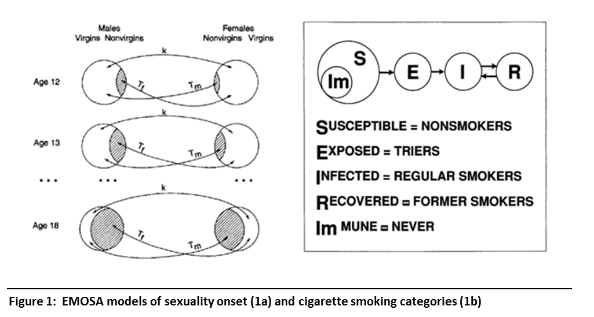

EMOSA
---  
Programming support to estimation of EMOSA (Epidemic Models of Onset of Social Activities) as applied to religious attendance of emergent adults. 

# Model Specification 

# Model Results
- [Diffusion Only](https://github.com/andkov/EMOSA/blob/master/DiffusionOnly/Diffusion%20results.pdf)  
- [Contagion Only](https://github.com/andkov/EMOSA/blob/master/ContagionOnly/Contagion%20results.pdf)  
- [Hybrid](https://github.com/andkov/EMOSA/blob/master/HybridOnly/Hybrid results.pdf)
