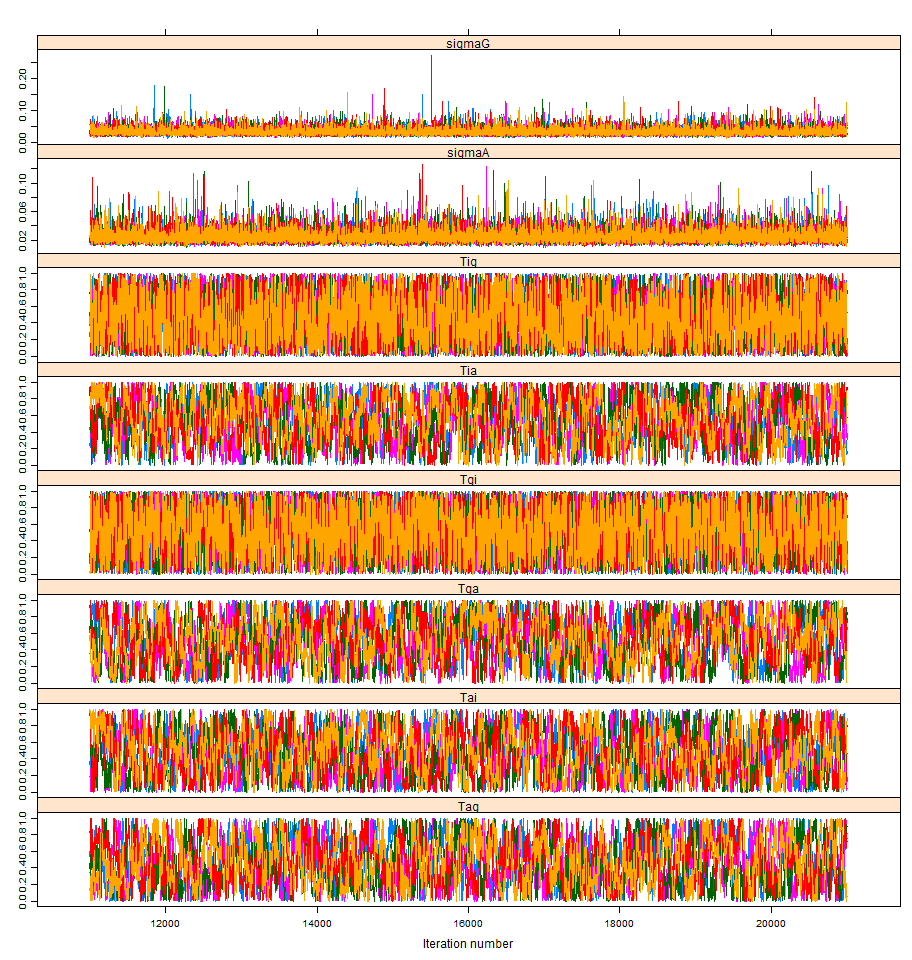
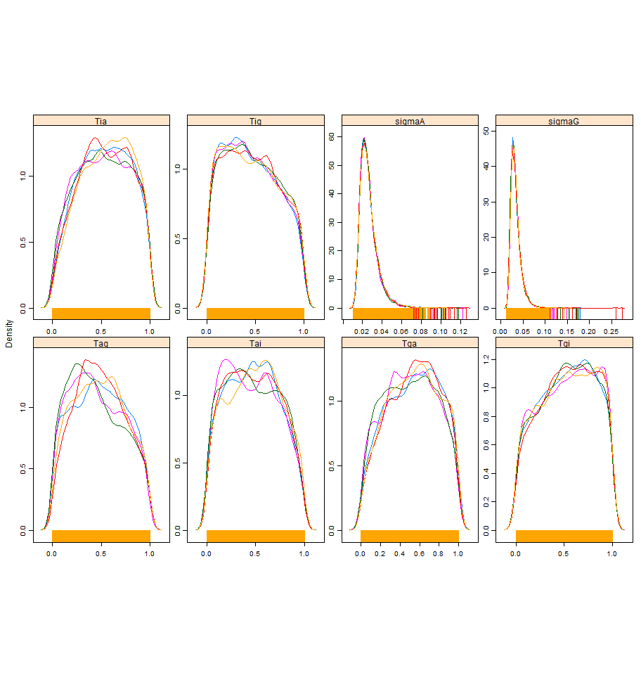
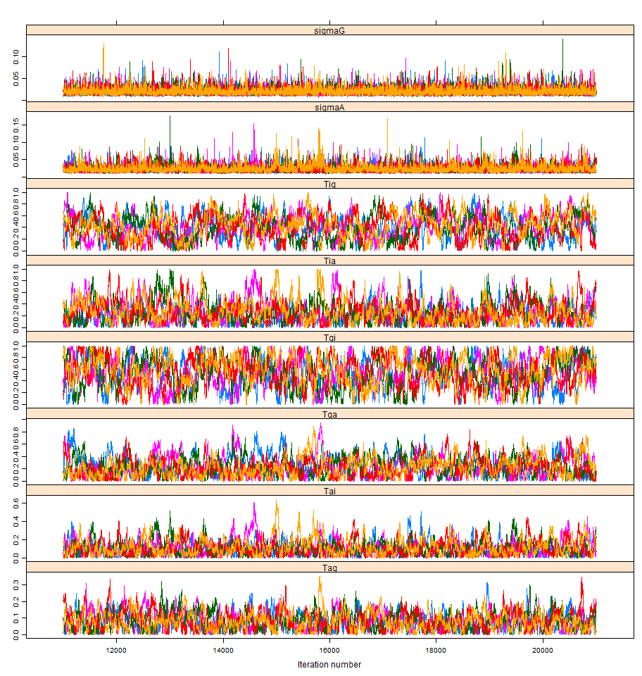
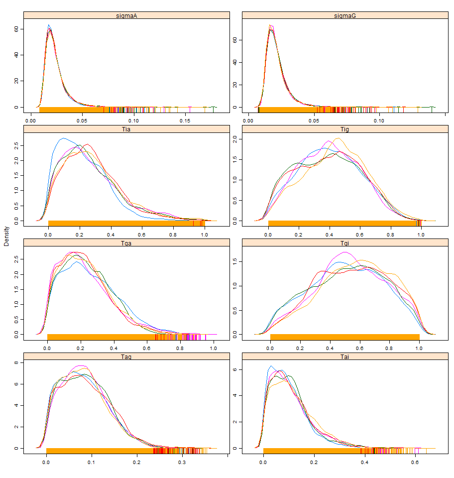
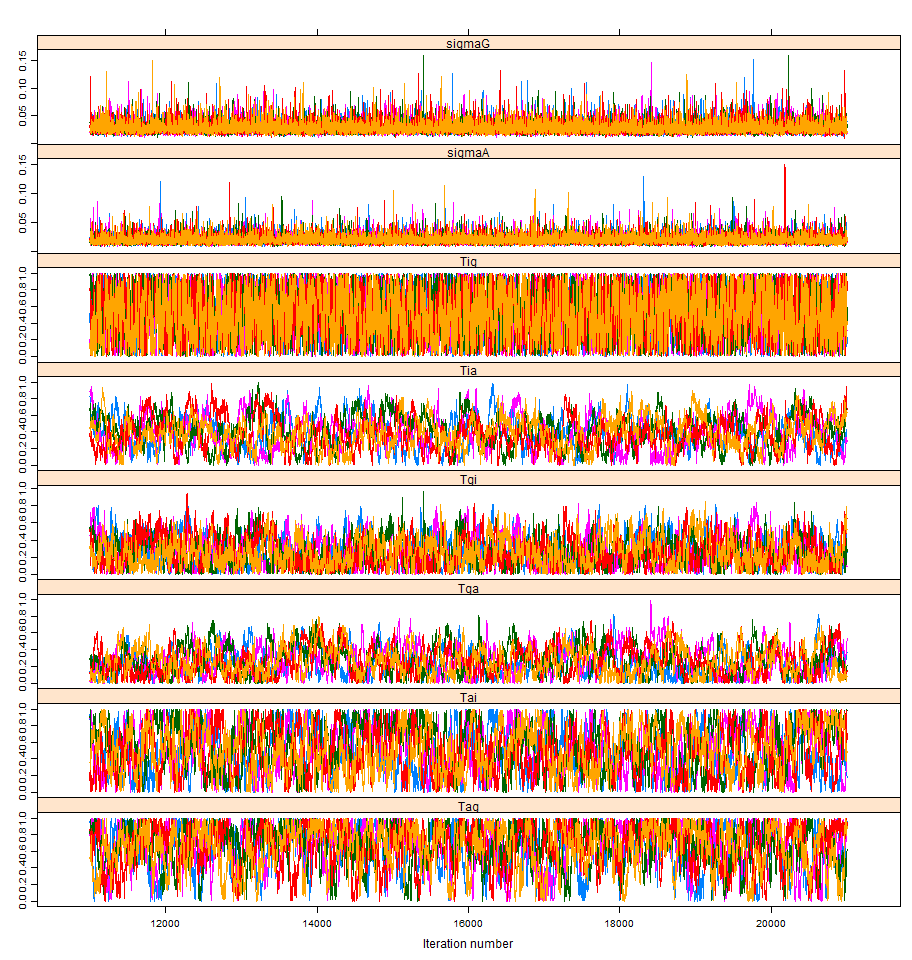
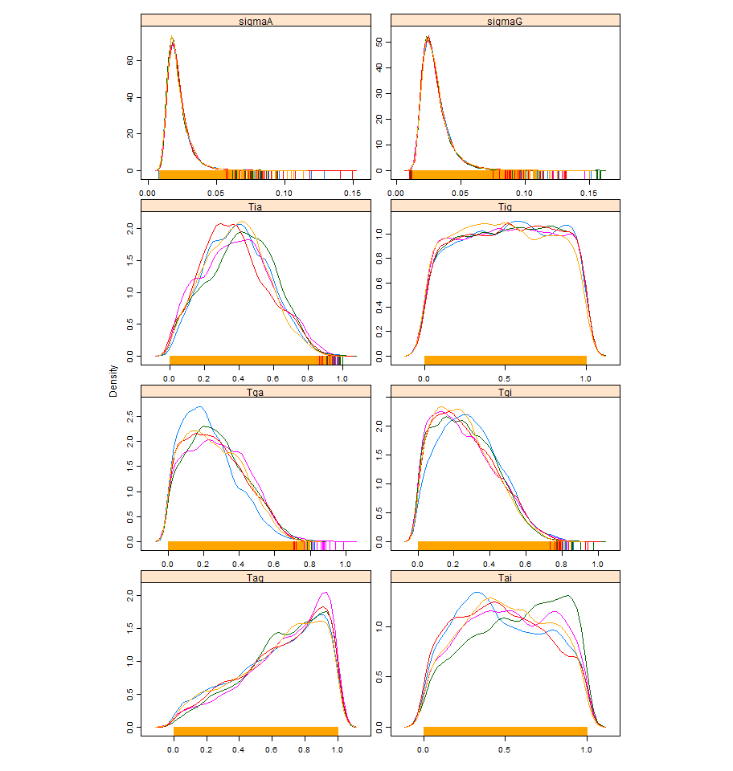

# Featured Figures

## Figure 1 

## Figure 2 

## Figure 3 

## Figure 4 

## Figure 5 

## Figure 6 

## Figure 7 

# Posterior Distributions

## Contagion

| Iterations | Density |   
|---|---|  
|  |  |   

## Diffusion

| Iterations | Density |   
|---|---|  
|  |  |   

## Hybrid

| Iterations | Density |   
|---|---|  
|  |  |   

